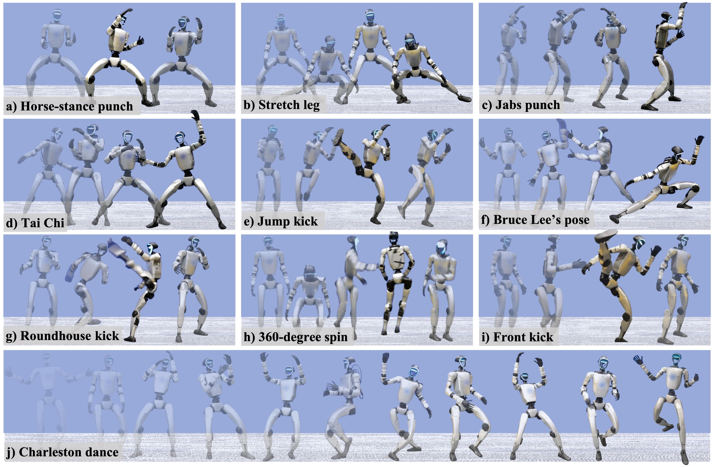
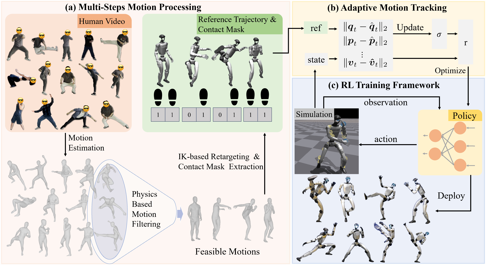

<br>
<p align="center">
<h1 align="center"><strong>KungfuBot: Physics-Based Humanoid Whole-Body Control for Learning Highly-Dynamic Skills</strong></h1>
  <p align="center">
    <a href="https://shi-soul.github.io/" target="_blank">Weiji Xie</a><sup>* 1,2</sup>,
    <a href="https://scholar.google.com/citations?hl=zh-CN&user=mJ7tn3MAAAAJ" target="_blank">Jinrui Han</a><sup>* 1,2</sup>,
    <a href="#" target="_blank">Jiakun Zheng</a><sup>* 1,3</sup>,
    <a href="https://scholar.google.com/citations?user=XhAo4J0AAAAJ&hl=zh-CN" target="_blank">Huanyu Li</a><sup>1,4</sup>,
    <a href="https://xinzheliu.github.io/" target="_blank">Xinzhe Liu</a><sup>1,5</sup>,
    <a href="https://scholar.google.com/citations?user=aVte5j4AAAAJ" target="_blank">Jiyuan Shi</a><sup>1</sup>,
    <a href="https://wnzhang.net" target="_blank">Weinan Zhang</a><sup>2</sup>,
    <a href="https://baichenjia.github.io/" target="_blank">Chenjia Bai</a><sup>&dagger;1</sup>,
    <a href="https://scholar.google.com.hk/citations?user=ahUibskAAAAJ" target="_blank">Xuelong Li</a><sup>1</sup>
    <br>
    * Equal Contribution  &dagger; Corresponding Author
    <br>
    <sup>1</sup>Institute of Artificial Intelligence (TeleAI), China Telecom  
    <sup>2</sup>Shanghai Jiao Tong University  
    <sup>3</sup>East China University of Science and Technology  
    <sup>4</sup>Harbin Institute of Technology  
    <sup>5</sup>ShanghaiTech University
  </p>
</p>

<div id="top" align="center">

[](https://arxiv.org/abs/2506.12851)
[](https://kungfu-bot.github.io/)

</div>

## Demo

[]()


## News
- \[2025-06\] We release the code and paper for PBHC.

## Contents

- [Demo](#demo)
- [News](#news)
- [Contents](#contents)
- [About](#about)
- [Usage](#usage)
- [Folder Structure](#folder-structure)
- [Citation](#citation)
- [License](#license)
- [Acknowledgements](#acknowledgements)
- [Contact](#contact)

## About


[]()


This is the official implementation of the paper [KungfuBot: Physics-Based Humanoid Whole-Body Control for Learning Highly-Dynamic Skills](https://kungfu-bot.github.io/).


Our paper introduces a physics-based control framework that enables humanoid robots to learn and reproduce challenging motions through multi-stage motion processing and adaptive policy training.

This repository includes:
- Motion processing pipeline
  - Collect human motion from various sources (video, LAFAN, AMASS, etc.) to a unified SMPL format (`motion_source/`)
  - Filter, correct and retarget human motion to the robot (`smpl_retarget/`)
  - Visualize and analyze the processed motions (`smpl_vis/`, `robot_motion_process/`)
- RL-based motion imitation framework (`humanoidverse/`)
  - Train the policy in IsaacGym
  - Deploy trained policies in MuJoCo for sim2sim verification. The framework is designed for easy extension--custom policies and real-world deployment modules can be plugged in with minimal effort
- Example data (`example/`)
  - Sample motion data in our experiments (`example/motion_data/`, you can visualize the motion data with tools in `robot_motion_process/`)
  - A pretrained policy checkpoint (`example/pretrained_hors_stance_pose/`)


## Usage

- Refer to `INSTALL.md` for environment setup and installation instructions.

- Each module folder (e.g., `humanoidverse`, `smpl_retarget`) contains a dedicated `README.md` explaining its purpose and usage.

- How to let your robot perform a new motion?
  - Collect the motion data from the source and process the motion data to the SMPL format (`motion_source/`).
  - Retarget the motion data to the robot (`smpl_retarget/`, choose `Mink` or `PHC` pipeline as you like).
  - Visualize the processed motion to check whether the motion quality is satisfiable (`smpl_vis/`, `robot_motion_process/`).
  - Train a policy for the processed motion in IsaacGym (`humanoidverse/`).
  - Deploy the policy in MuJoCo or real-world robot (`humanoidverse/`).

## Folder Structure

- `description`: provide description file for SMPL and G1 robot.
- `motion_source`: docs for getting SMPL format data.
- `smpl_retarget`: tools for SMPL to G1 robot retargeting.
- `smpl_vis`: tools for visualizing SMPL format data.
- `robot_motion_process`: tools for processing robot format motion. Including visualization, interpolation, and trajectory analysis.
- `humanoidverse`: training RL policy
- `example`: example motion and ckpt for using PBHC


## Citation

If you find our work helpful, please cite:

```bibtex
@article{xie2025kungfubot,
  title={KungfuBot: Physics-Based Humanoid Whole-Body Control for Learning Highly-Dynamic Skills},
  author={Xie, Weiji and Han, Jinrui and Zheng, Jiakun and Li, Huanyu and Liu, Xinzhe and Shi, Jiyuan and Zhang, Weinan and Bai, Chenjia and Li, Xuelong},
  journal={arXiv preprint arXiv:2506.12851},
  year={2025}
}
```


## License

This project is licensed under the MIT License - see the [LICENSE](LICENSE) file for details.

## Acknowledgements

- [ASAP](https://github.com/LeCAR-Lab/ASAP): We use `ASAP` library to build our RL codebase.
- [RSL_RL](https://github.com/leggedrobotics/rsl_rl): We use `rsl_rl` library for the PPO implementation.
- [Unitree](https://www.unitree.com/): We use `Unitree G1` as our testbed robot.
- [Maskedmimic](https://github.com/NVlabs/ProtoMotions): We use the retargeting pipeline in `Maskedmimic`, which based on [Mink](https://github.com/kevinzakka/mink).
- [PHC](https://github.com/ZhengyiLuo/PHC): We incorporate the retargeting pipeline from `PHC` into our implementation.
- [GVHMR](https://github.com/zju3dv/GVHMR): We use `GVHMR` to extract motions from videos.
## Contact

Feel free to open an issue or discussion if you encounter any problems or have questions about this project.

For collaborations, feedback, or further inquiries, please reach out to:

- Weiji Xie: [xieweiji249@sjtu.edu.cn](mailto:xieweiji249@sjtu.edu.cn) or Weixin `shisoul`
- Jinrui Han: [jrhan82@sjtu.edu.cn](mailto:jrhan82@sjtu.edu.cn)
- Chenjia Bai (Corresponding Author): [baicj@chinatelecom.cn](mailto:baicj@chinatelecom.cn)
- You can also join our weixin discussion group for timely Q&A:


We welcome contributions and are happy to support the community in building upon this work!
